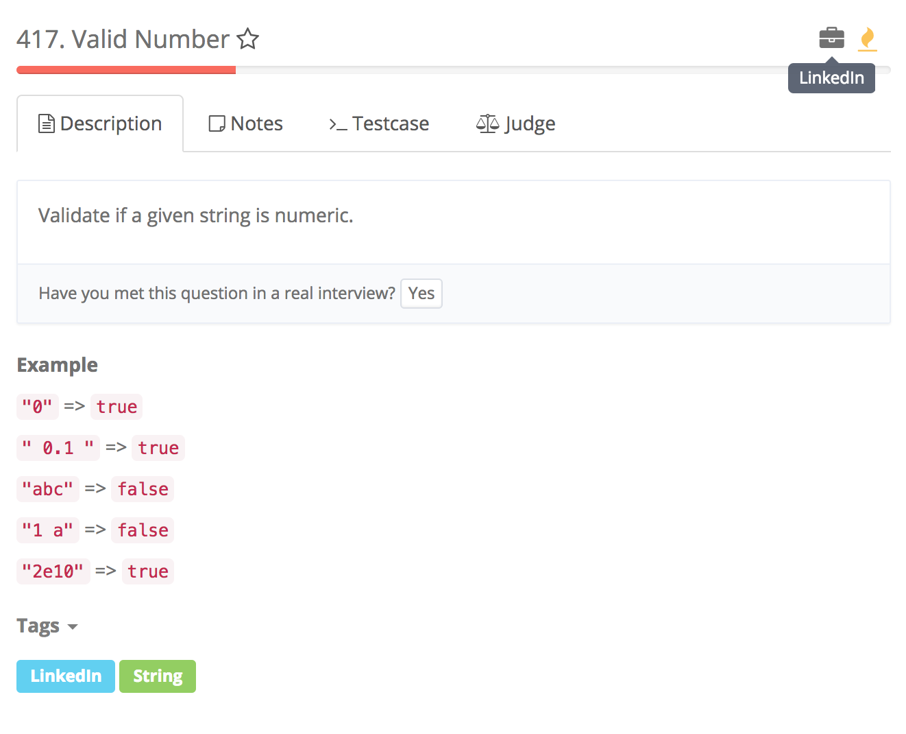

# Valid Number



Note: It is intended for the problem statement to be ambiguous. You should gather all requirements up front before implementing one.

## Idea1:

We start with trimming.

1. If we see \[0-9\] we reset the number flags.
2. We can only see . if we didn’t see e or ..
3. We can only see e if we didn’t see e but we did see a number. We reset numberAfterE flag.
4. We can only see + and - in the beginning and after an e any other character break the validation.

At the and it is only valid if there was at least 1 number and if we did see an e then a number after it as well.

So basically the number should match this regular expression:

\[-+\]?\(\(\[0-9\]+\(.\[0-9\]\*\)?\)\|.\[0-9\]+\)\(e\[-+\]?\[0-9\]+\)?

## Code

```text
class Solution {
    public boolean isNumber(String s) {
        s = s.trim();
        boolean pointSeen = false;
        boolean eSeen = false;
        boolean numberSeen = false;
        for(int i=0; i<s.length(); i++) {
            if('0' <= s.charAt(i) && s.charAt(i) <= '9') { //*
                numberSeen = true;
            } else if(s.charAt(i) == '.') {
                if(eSeen || pointSeen)
                    return false;
                pointSeen = true;
            } else if(s.charAt(i) == 'e') {
                if(eSeen || !numberSeen)
                    return false;
                numberSeen = false; //*
                eSeen = true;
            } else if(s.charAt(i) == '-' || s.charAt(i) == '+') { //*
                if(i != 0 && s.charAt(i-1) != 'e') //*
                    return false;
            } else
                return false;
        }
        return numberSeen;
    }
}
```

## Ref

1. [\[LeetCode\] Valid Number 验证数字](http://www.cnblogs.com/grandyang/p/4084408.html)

