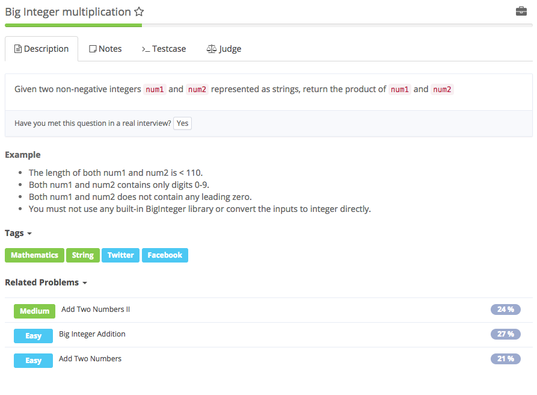

# big integer multiplication



## Analysis

### Idea:

1. 就模仿十进制的乘法，

   

```text
public String multiply(String num1, String num2) {
    int m = num1.length(), n = num2.length();
    int[] pos = new int[m + n];

    for(int i = m - 1; i >= 0; i--) {
        for(int j = n - 1; j >= 0; j--) {
            int mul = (num1.charAt(i) - '0') * (num2.charAt(j) - '0'); 
            int p1 = i + j, p2 = i + j + 1;
            int sum = mul + pos[p2];

            pos[p1] += sum / 10;
            pos[p2] = (sum) % 10;
        }
    }  

    StringBuilder sb = new StringBuilder();
    for(int p : pos) if(!(sb.length() == 0 && p == 0)) sb.append(p);
    return sb.length() == 0 ? "0" : sb.toString();
}
```

### 知识点：

1. 【不太懂耶】for\(int p : pos\) if\(!\(sb.length\(\) == 0 && p == 0\)\) sb.append\(p\);
2. letter combinations of a phone number 中 String letters = KEYS\[\(digits.charAt\(pos\)-'0'\)\]; 【//digits.charAt\(pos\)是读取数字，该数字作为index读取到KEYS中数字相对应的字母 为什么要-'0'?】

   同上 int mul = \(num1.charAt\(i\) - '0'\) \* \(num2.charAt\(j\) - '0'\); 

