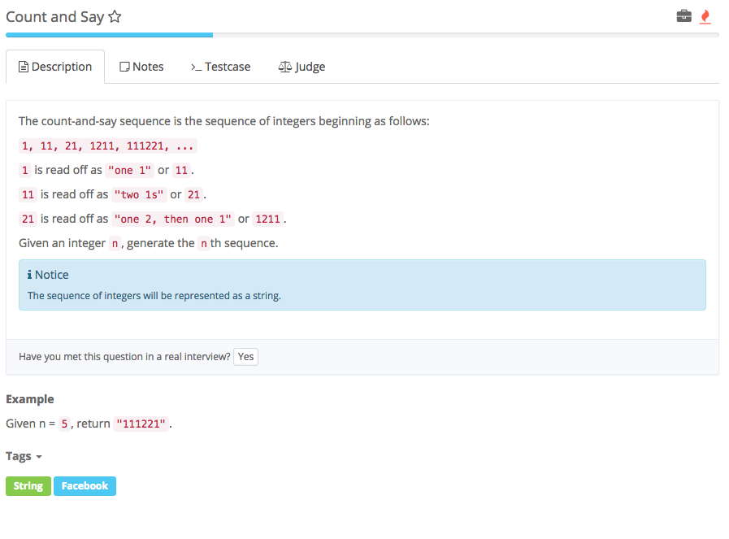

# count and say



## Analysis

### Idea:

1. 就是把计算过程code出来
2. oldString 存放当前要读的字符串
3. while\(--n &gt; 0\)保证n轮读
   1. 每一次都new StringBuilder存放读后的结果
   2. 用字符数组存放oldString的字符，方便用index traverse **char\[\] oldChars = oldString.toCharArray\(\)**
   3. init count = 1
   4. while统计重复的个数。重点：while中一定要有**\(i+1\) &lt; oldChars.length**, 避免index out of bound和若到数组尾可退出while。
   5. while结束后，把读到的count和该数字加到sb中。若未到oldChars数组尾就继续读，把读到的继续往sb后加。直到读完oldChars，**把sb赋给oldString**.
   6. 当前这轮结束，用updated的oldString继续下一轮直到n=0。return oldString

```text
public class Solution {
    /*
     * @param n: the nth
     * @return: the nth sequence
     */
    public String countAndSay(int n) {
        // write your code here
        // Initialize the beginning string
        String oldString = "1";
        // 求第n个
        while (--n > 0) {
            // stringbuilder 创建新字符串
            StringBuilder sb = new StringBuilder();
            char [] oldChars = oldString.toCharArray(); //????
            for (int i = 0; i < oldChars.length; i++) {
                int count = 1;
                //继续统计该数字的个数
                while((i + 1) < oldChars.length && oldChars[i] == oldChars[i + 1]) {
                    count++;
                    i++;
                }
                sb.append(String.valueOf(count) + String.valueOf(oldChars[i]));
            }
            oldString = sb.toString(); //*
        }
        return oldString;

    }
}
```

### 知识点：

1. StringBuilder sb = new StringBuilder\(\)  
2. sb.toString\(\) 把StringBuilder转换为字符串
3. char\[\] charsArr = **String.toCharArray\(\)** 把字符转换为字符数组，可通过index访问，方便for loop traverse字符串的字符
4. **String.valueOf\(\)** 转换为字符串

