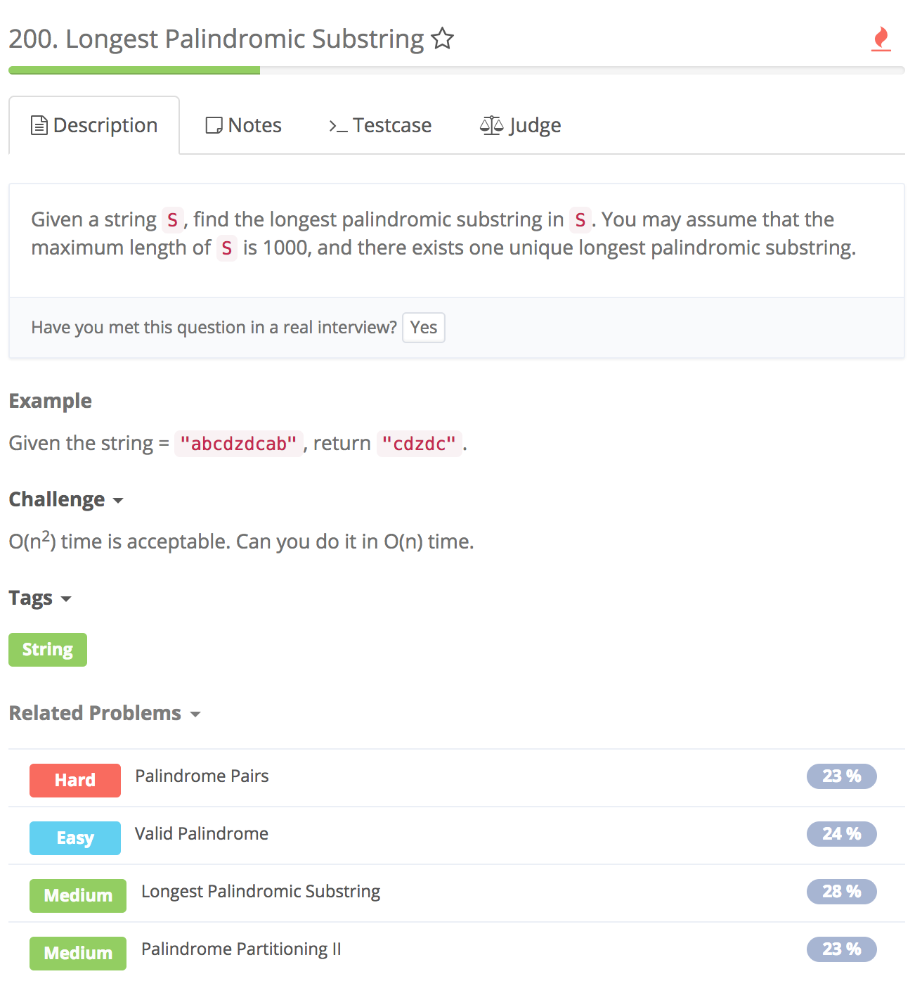

# Longest palindromic substring



## 假设

1. find a **substring** which is longest palindromic substring

## Idea

1. 两种情况：     

```text
        i
      <-|->
    1. aba
        ii+1
      <-||->
    2. abba
```

## Sol

1. init max, len\(of substring\)
2. cc: s.length\(\) &lt; 2, return s
3. for loop to pick the start ele:

    i. then spread in two ways by **helper function**

## Error

1. while\(s.charAt\(left\)==s.charAt\(right\) && left &gt;= 0 && right &lt; s.length\(\)\) 1. log:Exception in thread "main" java.lang.StringIndexOutOfBoundsException: String index out of range: -1 at java.lang.String.charAt\(String.java:658\) at Solution.extendSubstr\(Solution.java:2 3\) 2. 理解：当left = -1时，若while中s.charAt的判断在前，那么s.charAt\(left\)就会报错，left在字符串中out of range. 3. 所以：要先判断left和right的大小，符合条件了，再判断s.charAt\(\)从而保证了index不会越界 4. 改正：while\(left &gt;= 0 && right &lt; s.length\(\) && s.charAt\(left\) == s.charAt\(right\)\)
2. 不要忘了Corner Case
3. extend substring 的for loop中，**i&lt;len-1**，因为当extendSubstr\(s, i, i+1\) i+1不会越界
4. start = left + 1，因为while结束后left多-1，所以要加上才是substring的首个char
5. 同理，while结束后right多+1，所以计算当前substring的长度= right-left-1

## Code

```text
private int max, start; // **全局变量，extendSubstr中能用
    public String longestPalindrome(String s) {
        int len = s.length();
        //cc
        if(len < 2){ //**
            return s;
        }
        //extend substring
        for(int i = 0; i < len-1; i++){ //**
            extendSubstr(s, i, i);
            extendSubstr(s, i, i+1);
        }
         return s.substring(start, start + max); //**
    }

    // extendSubstr 
    private void extendSubstr(String s, int left, int right){
        while(left >= 0 && right < s.length() && s.charAt(left) == s.charAt(right)){ //先判断index，确保index不会out of range
            left--;
            right++;
        }
        if(max < right-left-1){
           start = left + 1; //**
           max = right-left-1; //*
        }
    }
```

## 重点：

1. 一定要考虑index会不会越界

