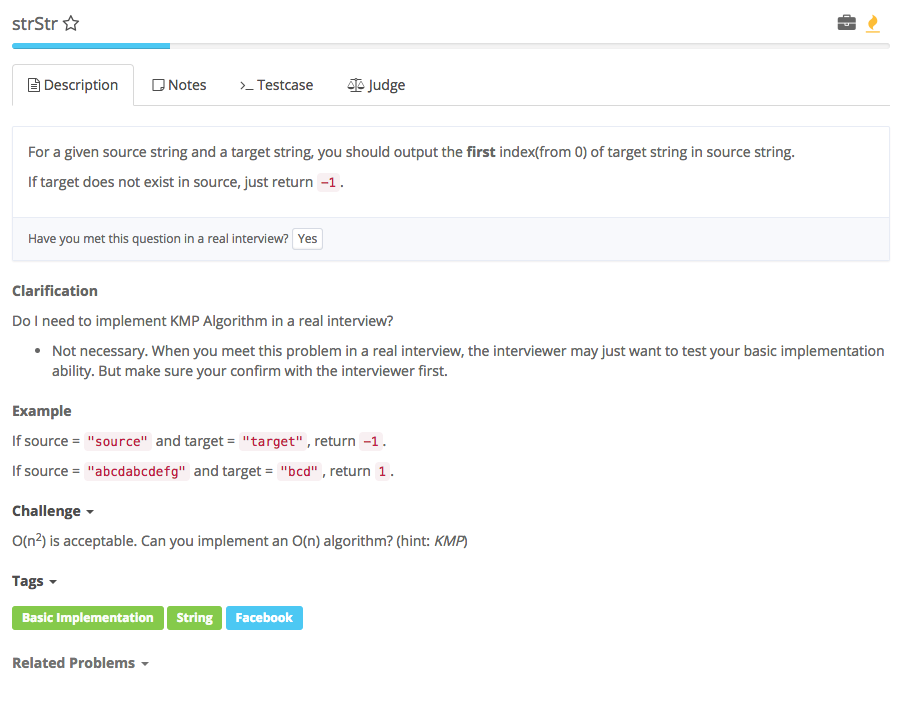
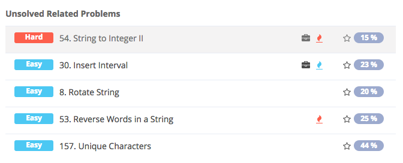

# strStr



## Analysis

### Idea:

1. 在source中找到substring与target相同

    i=0开始，作为substring的首字母，开始与target比较，一样就返回i。 一直找到i &lt; m-n+1

```text
class Solution {
    /**
     * Returns a index to the first occurrence of target in source,
     * or -1  if target is not part of source.
     * @param source string to be scanned.
     * @param target string containing the sequence of characters to match.
     */
    public int strStr(String source, String target) {
        // write your code 
        if (source == null || target == null) {
            return -1;
        }
        for (int i = 0; i < source.length() - target.length() + 1; i++) {
            int j = 0;
            for (j = 0; j < target.length(); j++) {
                if (source.charAt(i + j) != target.charAt(j)) { //* 在i不变的情况下，逐个比较source和target的 字母
                    break;
                }
            }
            if (j == target.length()) {
                return i;
            }
        }
        return -1;
    }
}
```

#### Error:

1. for\(int j = 0; j &lt; n; j++\) 然后if\(j== n\)

    log:  cannot find symbol: variable j

    原因：j在for中初始化，只属于for中，for结束后j也就不存在。

    所以：j的初始化在for外，这样if也能用

    int j = 0; for\(; j &lt; n; j++\)

   

