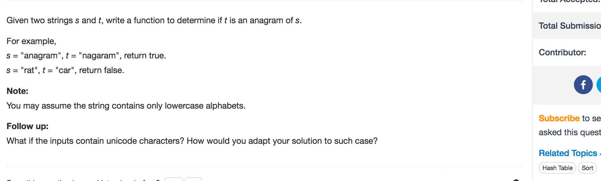

# Valid Anagram



## Idea

对对碰 HashMap 不能traverse 用不到Key可以用int\[\]代替

## Code

```text
public boolean isAnagram(String s, String t) {
        int[] charsMap = new int['z'-'a'+1];

        for(char c: s.toCharArray()) {
            int pos = c - 'a';
            charsMap[pos]++;
        }

        for(char c: t.toCharArray()) {
            int pos = c - 'a';
            charsMap[pos]--;
        }

        for(int count: charsMap) {
            if(count != 0) {
                return false;
            }
        }

        return true;
    }
```

