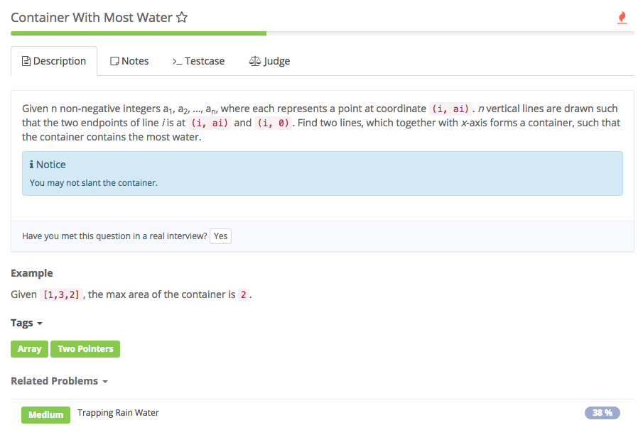

# container with most water

、

## Analysis

### Idea:

1. container的高由短的决定，用Math.min找到短的作为高，因为任意找两个line作为边，由left和right决定，所以宽就是right-left
2. ans记录最大area
3. 目标是找最大面积，所以若左边比右边短，保留右边，**left++去找更长的左边** 左边比右边大 right--

```text
public class Solution {
    /*
     * @param heights: a vector of integers
     * @return: an integer
     */
    public int maxArea(int[] heights) {
        // write your code here
        if (heights == null || heights.length == 0) {
            return 0;
        }
        int left = 0, ans = 0;
        int right = heights.length - 1;
        while (left <= right) {
            ans = Math.max(ans, (right - left) * Math.min(heights[left], heights[right]));
            if (heights[left] < heights[right]) {
                left++;
            } else {
                right--;
            }
        }
        return ans;
    }
}
```

### 难点：

1. 注意是任意找两个线作为边

### 知识点：

1. coordinate: 坐标 slant: 倾斜++++++++++++

