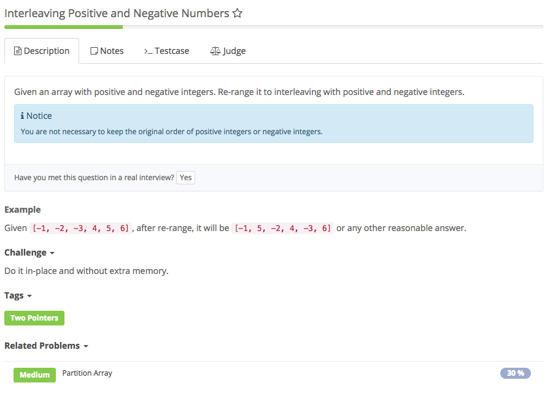

# Interleaving positive and negative numbers



## Analysis

### Idea:

本题若要得到合理的答案，则数组中正负数的个数要么相等，要么比另一种数最多大1个。而题目没有保证正负数个数相等，所以需对数组进行预处理（数组长度为偶数时无需预处理），使得当正（负）数多时，数组第一个数为正（负）。  
1. 统计正负数的个数  
init 两个指针分别指向正数和负数，即posP = 0,posN = 1  
若正数比负数多，则第一个数是正数，两指针不变  
若负数比正数多，则第一个数是负数，posP = 1, posN = 0  
2. 从正负指针指向的位置，每次+2，把不在其位的数交换即可

```text
  public void rerange(int[] A) {
         if(A == null || A.length == 0) {
            return;
        }
        //init: #negative >= #positive, 1st should be negative
        int posP = 1, posN = 0,len = A.length;
        int count = 0;
        for(int num : A) {
            if(num > 0) {
                count++;
            }
        }
        //if #positive > #negative, 1st should be positive
        if(count*2 > len) {
            posP = 0;
            posN = 1;
        }
        while(posP < len && posN < len){
            //default: 1st is odd, pointer odd 
            while(posN < len && A[posN]<0) { //* 不要拆分到if中判断                
                    posN +=2;                
            }

            while(posP < len && A[posP] > 0) {

                    posP +=2;
            }
            //exchange
            if(posN < len && posP < len){
                int temp = A[posN];
                A[posN] = A[posP];
                A[posP] = temp;
            }
        }
    }
```

