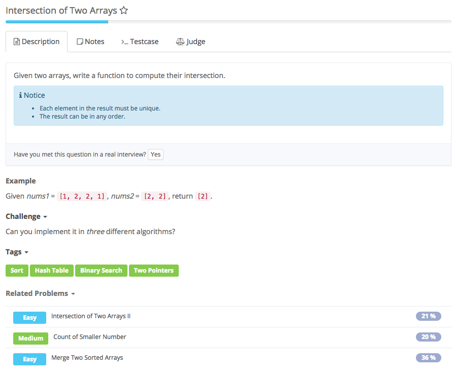

# intersection of two arrays



## Analysis

### Idea:

找两个数组中重复的元素，且在答案数组中重复元素只出现一次。  
1. 第一种想法是先对两个数组排序，然后从头开始依次比较两个数组的值，直到一个数组用尽。  
若相等，并且答案数组中没有，则加入答案数组  
若不相等，则将小的增大  
2. 第二种想法是利用HashSet。先将一个数组加入到一个第一个HashSet中，然后遍历另外一个数组，若其中元素在第一个HashSet中，则将相等的元素加入到另一个作为答案的HashSet中。  
3. 第三中方法可以先将一个数组排序后，遍历第二个数组，用binary search的方法在第一个数组中寻找第二个数组的元素。+

第一个方法O\(nlogn\)，但是若数组已经排好序，则O\(n\)。  
第二个方法时间O\(n\)，空间O\(n\)。  
第三个方法时间O\(mnlogn\)。

```text
// version 1: sort & merge
public class Solution {
    /**
     * @param nums1 an integer array
     * @param nums2 an integer array
     * @return an integer array
     */
    public int[] intersection(int[] nums1, int[] nums2) {
        Arrays.sort(nums1);
        Arrays.sort(nums2);

        int i = 0, j = 0;
        int[] temp = new int[nums1.length];
        int index = 0;
        while (i < nums1.length && j < nums2.length) {
            if (nums1[i] == nums2[j]) {
                if (index == 0 || temp[index - 1] != nums1[i]) { //跳过重复
                    temp[index++] = nums1[i];
                }
                i++;
                j++;
            } else if (nums1[i] < nums2[j]) {
                i++;
            } else {
                j++;
            }
        }

        int[] result = new int[index];
        for (int k = 0; k < index; k++) {
            result[k] = temp[k];
        }

        return result;
    }
}

// version 2: hash map
public class Solution {
    /**
     * @param nums1 an integer array
     * @param nums2 an integer array
     * @return an integer array
     */
    public int[] intersection(int[] nums1, int[] nums2) {
        if (nums1 == null || nums2 == null) {
            return null;
        }

        HashSet<Integer> hash = new HashSet<>();
        for (int i = 0; i < nums1.length; i++) {
            hash.add(nums1[i]);
        }

        HashSet<Integer> resultHash = new HashSet<>();
        for (int i = 0; i < nums2.length; i++) {
            if (hash.contains(nums2[i]) && !resultHash.contains(nums2[i])) {
                resultHash.add(nums2[i]);
            }
        }

        int size = resultHash.size();
        int[] result = new int[size];
        int index = 0;
        for (Integer num : resultHash) {
            result[index++] = num;
        }

        return result;
    }
}

// version 3: sort & binary search
public class Solution {
    /**
     * @param nums1 an integer array
     * @param nums2 an integer array
     * @return an integer array
     */
    public int[] intersection(int[] nums1, int[] nums2) {
        if (nums1 == null || nums2 == null) {
            return null;
        }

        HashSet<Integer> set = new HashSet<>();

        Arrays.sort(nums1);
        for (int i = 0; i < nums2.length; i++) {
            if (set.contains(nums2[i])) {
                continue;
            }
            if (binarySearch(nums1, nums2[i])) {
                set.add(nums2[i]);
            }
        }

        int[] result = new int[set.size()];
        int index = 0;
        for (Integer num : set) {
            result[index++] = num;
        }

        return result;
    }

    private boolean binarySearch(int[] nums, int target) {
        if (nums == null || nums.length == 0) {
            return false;
        }

        int start = 0, end = nums.length - 1;
        while (start + 1 < end) {
            int mid = (end - start) / 2 + start;
            if (nums[mid] == target) {
                return true;
            }
            if (nums[mid] < target) {
                start = mid;
            } else {
                end = mid;
            }
        }

        if (nums[start] == target) {
            return true;
        }
        if (nums[end] == target) {
            return true;
        }

        return false;
    }
}
```

