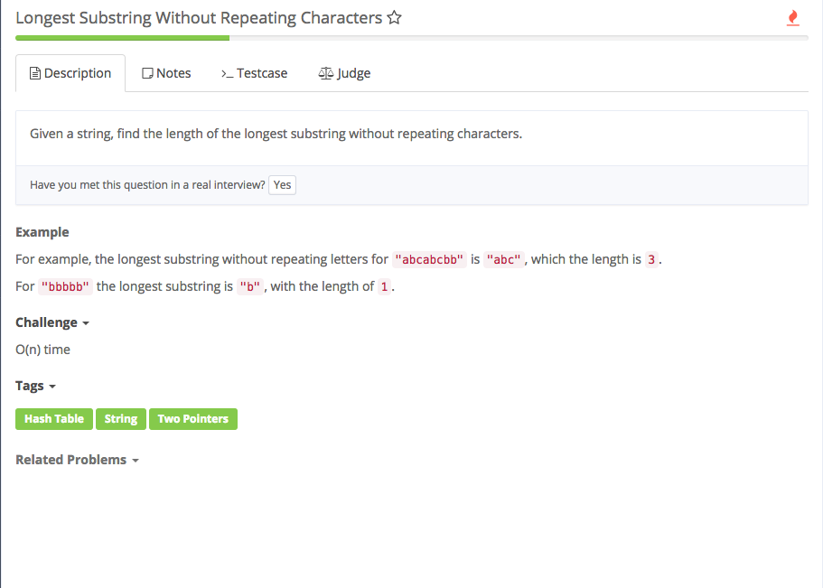

# longest substring without repeating characters



## Analysis

### Idea:

用two pointers i：标记每一个substring的开头 j：标记扫到的character 1. 从头扫，用hashmap记录遇到的character，随后标记长度，接着扫下一个。 2. 如果j扫到下一个是在hashmap中，就停止该substring，将从该substring的开头即i位置开始到jhashmap值都为0 map\[s.charAt\(i\)\] = 0。然后挪动i开始一个新substring的开头

```text
public class Solution {
    /*
     * @param s: a string
     * @return: an integer
     */
    public int lengthOfLongestSubstring(String s) {
        // write your code here
        // all possible characters
        int[] map = new int[256];
        int i = 0;
        int j = 0;
        int ans = 0;
        for (i = 0; i < s.length(); i++) {
            while (j < s.length() && map[s.charAt(j)] == 0) {
                map[s.charAt(j)] = 1;
                ans = Math.max(ans, j - i + 1);
                j++;
            }
            map[s.charAt(i)] = 0; 
        }
        return ans;
    }
}
```

