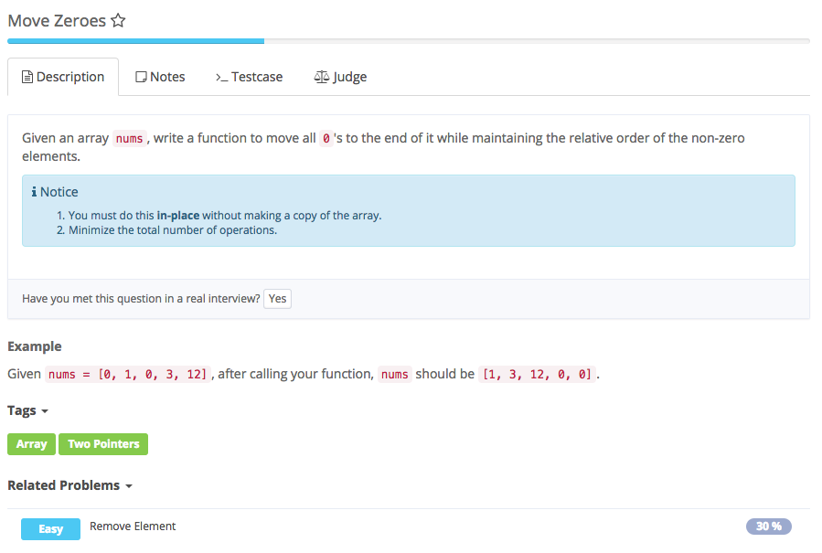

# move zeros



## Analysis

### Idea:

与remove element相似  
1. two pointer 初始化 left = 0 第一个为0的数 right 第一个不为0的数  
2. 只要right不为0，left和right交换后left++  
3. right++  
特别的情况就是：left和right指向同一个非0，它们原地自换  
**这样right就跳过所有的0，只是把right指向的非0按顺序放到最前面，即left从0开始，这样循环直到right到底, left记录的就是顺序**

#### Corner Case:

1. \[1,3,0,4,0,5\]

#### Error

1. int left = right = 0

    log: Line 6: error: cannot find symbol: variable right

    更改：int left = 0, right;

```text
public class Solution {
    /**
     * @param nums an integer array
     * @return nothing, do this in-place
     */
    public void moveZeroes(int[] nums) {
        // Write your code here
        int left = 0, right = 0;
        while (right < nums.length) {
            if (nums[right] != 0) {
                int temp = nums[left];
                nums[left] = nums[right];
                nums[right] = temp;
                left++;
            }
            right++;
        }
    }
}
```

