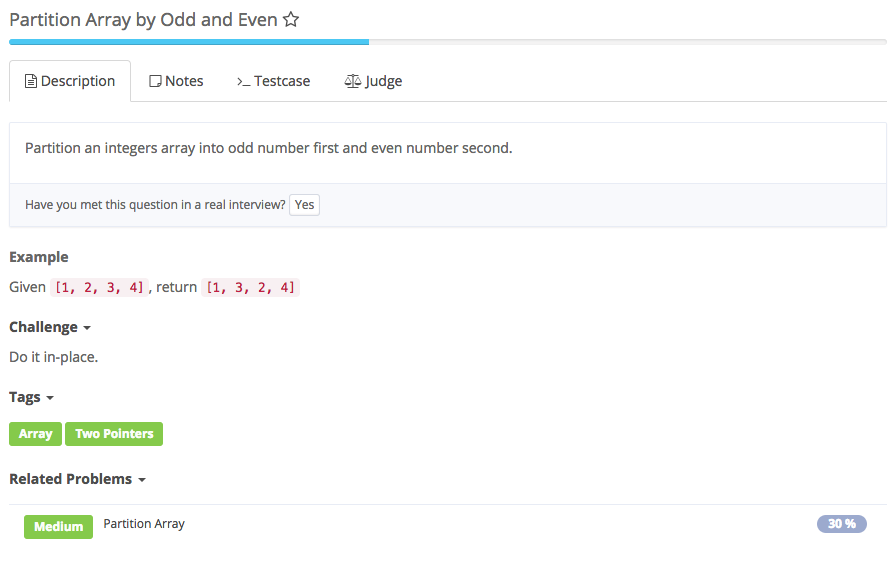
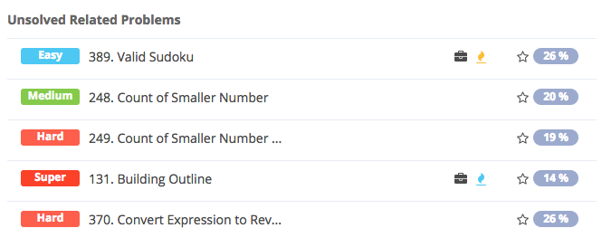

# partition array by Odd and Even



## Analysis

### Idea:

与partition array相似 1. 左右指针，初始化left = 0，right = nums.length - 1 2.left找到第一个不为奇数，right找到第一个不为偶数，然后交换，左右向中间挪一位继续找 前后指针。前指针从前往后遇到偶数停下，后指针从后往前遇到奇数停下，交换，继续，直到前后指针交叠。注意的地方是前指针从前往后走的时候要注意不要越界，后指针也一样。

```text
public class Solution {
    /**
     * @param nums: an array of integers
     * @return: nothing
     */
    public void partitionArray(int[] nums) {
        // write your code here
        if (nums == null || nums.length == 0) {
            return;
        }
        int left = 0, right = nums.length - 1;
        while (left < right) {
            while (left < right && nums[left] % 2 == 1) {
                left++;
            }
            while (left < right && nums[right] % 2 == 0) {
                right--;
            }
            // swap
            if (left < right) {
                int temp = nums[left];
                nums[left] = nums[right];
                nums[right] = temp;
                left++;
                right--;
            }
        }
    }
}
```



