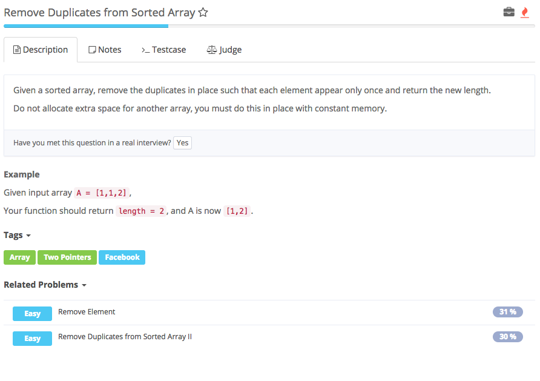

# remove duplicates from sorted array



## Analysis

### Idea:

这是sorted array 1. two pointer i:标记最后一个不重复的数 init i = 0, j:标记当前要判断的数 init j = 1 2. for loop\(int j = 0; j &lt; nums.length; j++\) 若扫到的数nums\[j\]与nums\[i\]不等， 1. i++，此时i为第一个重复的数，所以 2. nums\[i\]=nums\[j\], 若扫到的数nums\[j\]与nums\[i\]相等，j++，继续找和i不重复的数，找到后就是i++, nums\[i\]和nums\[j\]交换

i和j之间就是重复的数

```text
public class Solution {
    /**
     * @param A: a array of integers
     * @return : return an integer
     */
    public int removeDuplicates(int[] nums) {
        // 重点：不要忘了CC
        if (nums == null || nums.length == 0) {
            return 0;
        }
        int i = 0;
        for (int j = 1; j < nums.length; j++) {
            if (nums[i] != nums[j]) {
                i++;
                nums[i] = nums[j];
            }
        }
        return i + 1; //**
    }
}
```

