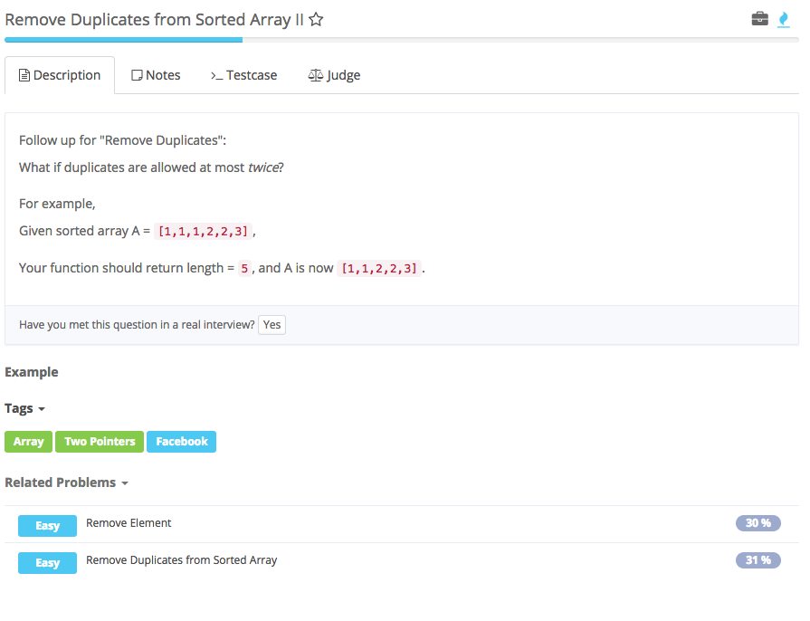

# remove duplicates from sorted arrayII



## Analysis

### Idea:

与前一道题基本相同  
1. 额外用一个boolean表示是否可以添加重复元素，只有boolean为true时才能添加重复元素。当添加一个新元素时，boolean设置为true，当添加一个重复元素后，boolean设置为false。

1. two pointers, i 最后一个合格数，i = 0； j 当前要判断的数 j=1

    nums\[i\] != nums\[j\], 

   ```text
    增加多一个合格数，所以把nums[j]放到nums[++i]上，即nums[++i] = nums[j];     
    j++;判断下一个数
    addMore = true; 可以再加一个 
   ```

    若相等，首先确定addMore是否为true，

   ```text
    为true，nums[++i] = nums[j]
    addMore = false; 不能再加了
   ```

```text
public class Solution {
    /**
     * @param A: a array of integers
     * @return : return an integer
     */
    public int removeDuplicates(int[] nums) {
        // write your code 
        if (nums == null || nums.length == 0) {
            return 0;
        }
        boolean addMore = true;
        int i = 0; //*不能放在for loop中，否则for loop结束后就销毁了
        for (int j = 1; j < nums.length; j++) {
            if (nums[i] != nums[j]) {
                nums[++i] = nums[j];
                addMore = true; 
            } else if (twice) {
                nums[++i] = nums[j]; 
                //一定要有这步，不能只是i++，否则input：[1,1,1,1,3,3]，error：[1,1,3,1]。因为要把符合条件的数放到最后一个非重复数后面
                addMore = false;
            }
        }
        return i + 1;
    }
}
```

