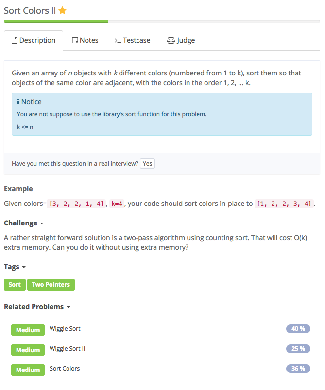
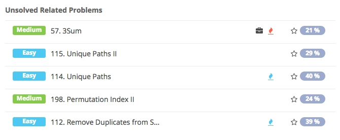

# sort colorsII



## Analysis

### Idea:

与sort colors相似 快排思想，找到fromColor到toColor的中点mid，将colors分为小于等于mid的和大于mid的两个部分，然后递归排序

```text
class Solution {
    /**
     * @param colors: A list of integer
     * @param k: An integer
     * @return: nothing
     */
    public void sortColors2(int[] colors, int k) {
        // write your code here
        if (colors == null || colors.length == 0) {
            return;
        }
        rainbowSort (colors, 0, colors.length - 1, 1, k);
    }
    public void rainbowSort(int[]colors,
                            int left,
                            int right,
                            int colorFrom,
                            int colorTo) {
        if (colorFrom == colorTo) {
            return;
        }
        if (left >= right) {
            return;
        }
        int colorMid = (colorFrom + colorTo) / 2;
        int l = left, r = right;
        while (l <= r) {
            // 略过所有小于等于Mid
            while (l <= r && colors[l] <= colorMid) {
                l++;
            }
            // 略过所有大于等于Mid
            while (l <= r && colors[r] > colorMid) {
                r--;
            }
            // 交换
            if (l <= r) {
                int temp = colors[l];
                colors[l] = colors[r];
                colors[r] = temp;
                l++;
                r--;
            }
        }
        // 此时数组分为两部分 left ~ r和l ~ right 再对这两部分进行以上的过程
        rainbowSort(colors, left, r, colorFrom, colorMid);
        rainbowSort(colors, l, right, colorMid + 1, colorTo);
    }
}
```



