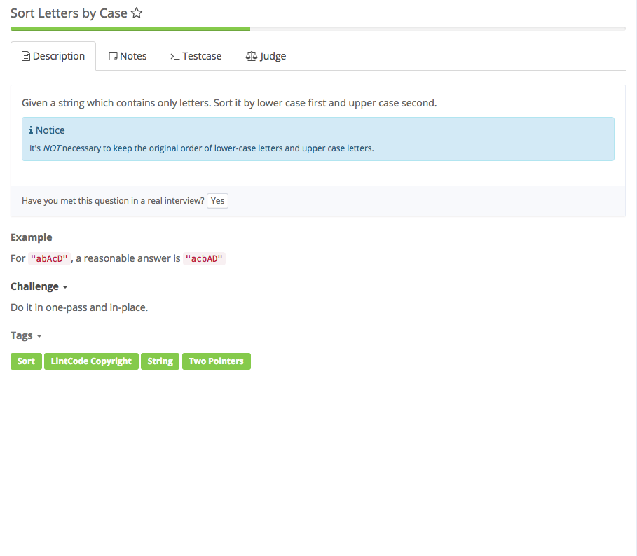

# sort letters by case



## Analysis

### Idea:

1. 和partition array 一样，左边的Uppercase和右边的Lowercase交换

```text
public class Solution {
    /** 
     *@param chars: The letter array you should sort by Case
     *@return: void
     */
    public void sortLetters(char[] chars) {
        //write your code here
        // in-place means need exchange variables' value; create a temp to store value
        char temp;
        int left = 0, right = chars.length - 1;
        while (left <= right) {
            //不用if，用while确保两指针未相遇
            while (left <= right && Character.isLowerCase(chars[left])) {
                left++;
            }
            while (left <= right && Character.isUpperCase(chars[right])) {
                right--;
            }
            if (left <= right) {
                temp = chars[left];
                chars[left] = chars[right];
                chars[right] = temp;
                left++;
                right--;
            }
        }
        return;
    }
}
```

### 知识点：

1. char\[\] 字符串长度：chars.length 访问字符串index i：chars\[i\]
2. 创建个字符变量？？ char 变量名；
3. 判读字符的case Character.isLowerCase\(chars\[i\]\) Character.isUpperCase\(chars\[i\]\) 

