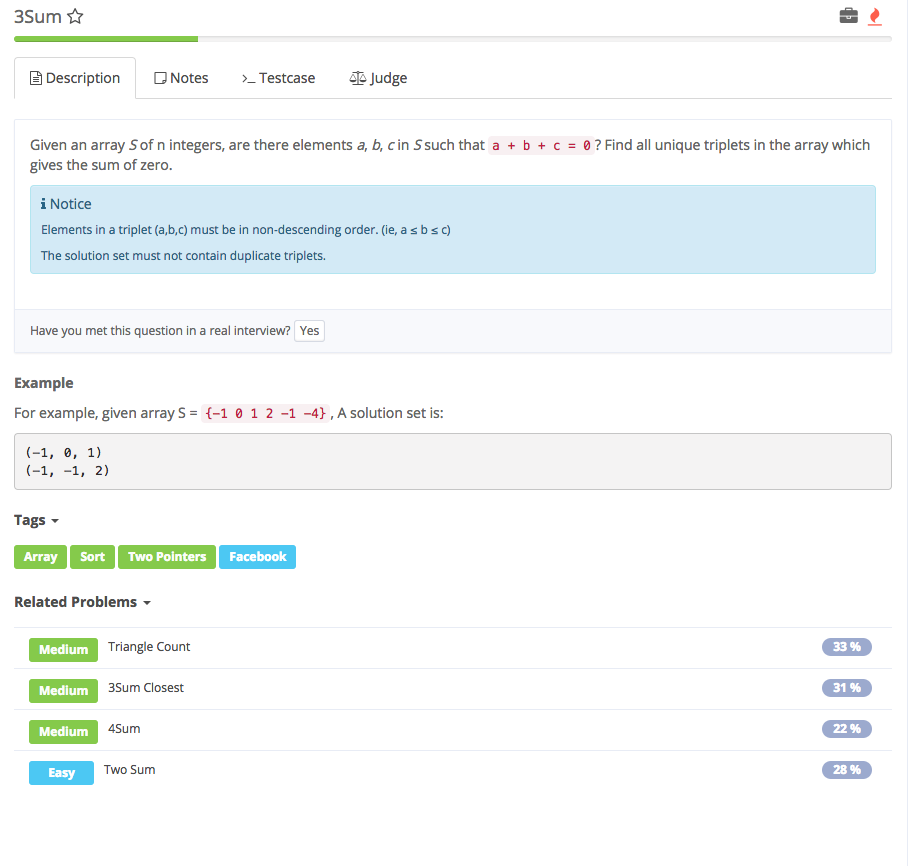

# Three sum

## Analysis

### 代码思路：

1. 用到什么变量 
2. 需要返回的结果是什么，用什么数据结构存储结果 
3. 根据解题思路一步步编程 

### 解题思路：

1. 这道题是Two Sum - Input is sorted的扩展，brute force时间复杂度为O\(n^3\), 对每三个数进行比较。这道题和Two Sum有所不同，使用哈希表的解法并不是很方便，因为结果数组中元素可能重复，如果不排序对于**重复的处理**将会比较麻烦，因此这道题一般使用排序之后夹逼的方法，总的时间复杂度为O\(n^2+nlogn\)=\(n^2\),空间复杂度是O\(n\)
2. 注意1：存放结果用List&gt;\[\]

   注意2：若nums\[i\] != nums\[i-1\]才从后面的ele中夹逼找出另外2个数

   注意3：if elseif else 判断3种情况

   注意4：在if中，要跳过重复

## Code:

```text

```

