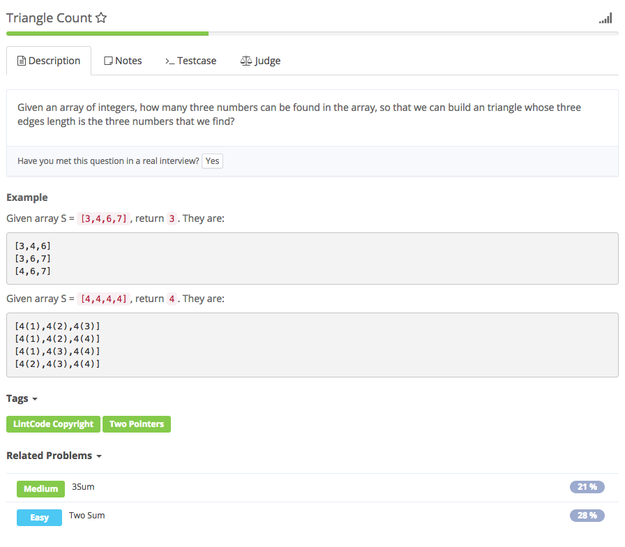

# triangle count



## Idea:

1. 任意两边之和大于第三边，则三边可组成三角形。、
   1. 找到最长边设为c，那么只要判断a+b&gt;c即可，无需再判断其他组合
2. 先排序 
3. 从i=2开始，nums\[i\]作为第三边，另外两边从i前面去找。init left = 0， right = i-1 若nums\[left\] + nums\[right\] &gt; nums\[i\]

   ```text
    那么 count += right - left, 即可能的组合有right-left个，因为排序了，所以left后面的数加上right也肯定大于nums[i]
    right-- 因为right一开始=i-1是最大的right，right--就继续往前找合适的right
   ```

   若nums\[left\] + nums\[right\]&lt;= nums\[i\]

   ```text
    left++，增大nums[left]的值
   ```

```text
public int triangleCount(int[] S) {
        // write your code here
        Arrays.sort(S);
        int count = 0;
        for (int i = 2; i < S.length; i++) {
            int left = 0;
            int right = i - 1;
            while (left < right) {
                if (S[left] + S[right] > S[i]) {
                    count += right - left;
                    right--;
                } else {
                    left++;
                }
            }
        }
        return count;
    }
```

## Ref

[1.](http://www.cnblogs.com/Dylan-Java-NYC/p/6362616.html)

