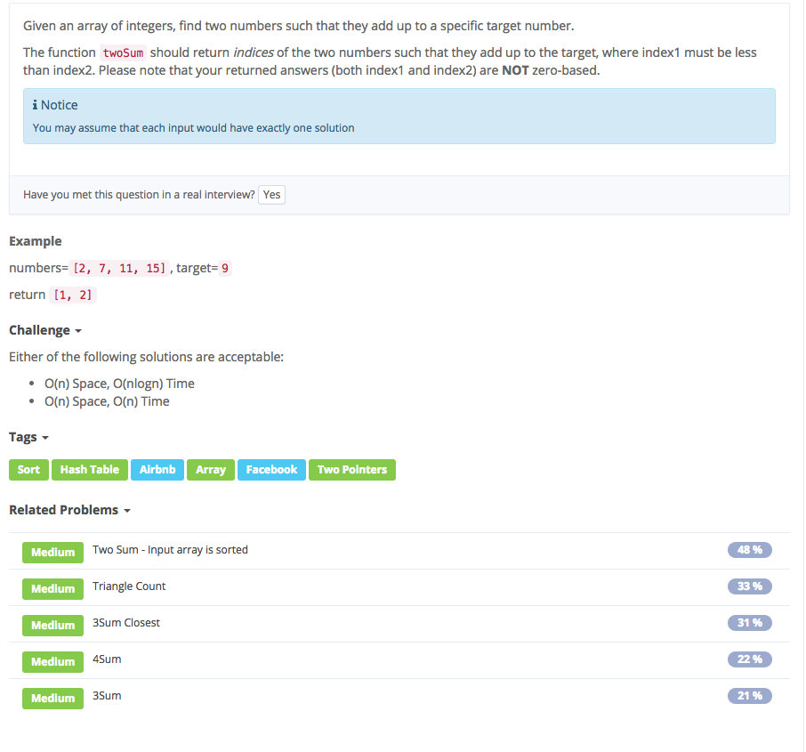
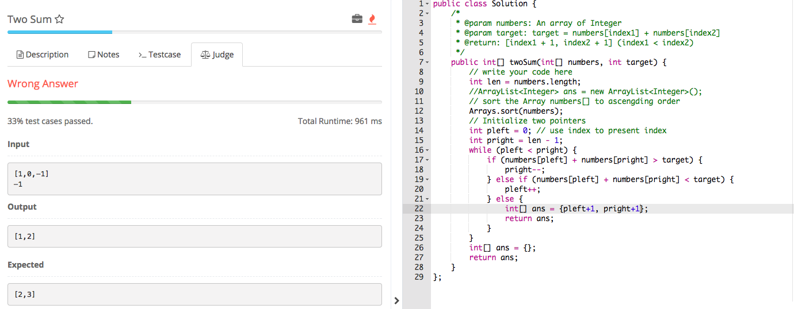

# two sum

## Analysis

### idear1:

1. 先对数组排序
2. 设置头尾两个指针 若头尾相加大于target，意味着尾部加上头部最小的都要比target大，尾部要被删除，尾指往前挪一位。若相加比target小，意味最小的加
3. 由于sort后，index有变，需要hashmap to store original index

### idear2:

1. use hashmap key: target - numbers\[i\]  value: i 
2. 如果numbers\[i\]不在hashmap中，意味着之前没有一个数的差为numbers\[i\], 故可以将target-numbers\[i\] 以及index i 存到表中。等待下一个数若与hashmap key 相等，返该数的index和value作为index1, index2。 故都+1

## Solution

```text
public class Solution {
    /*
     * @param numbers : An array of Integer
     * @param target : target = numbers[index1] + numbers[index2]
     * @return : [index1 + 1, index2 + 1] (index1 < index2)
         numbers=[2, 7, 11, 15],  target=9
         return [1, 2]
     */
    public int[] twoSum(int[] numbers, int target) {
        HashMap<Integer,Integer> map = new HashMap<>();

        for (int i = 0; i < numbers.length; i++) {
            if (map.get(numbers[i]) != null) {
                int[] result = {map.get(numbers[i]) + 1, i + 1};
                return result;
            }
            map.put(target - numbers[i], i);
        }

        int[] result = {};
        return result;
    }
}
```

## \*

