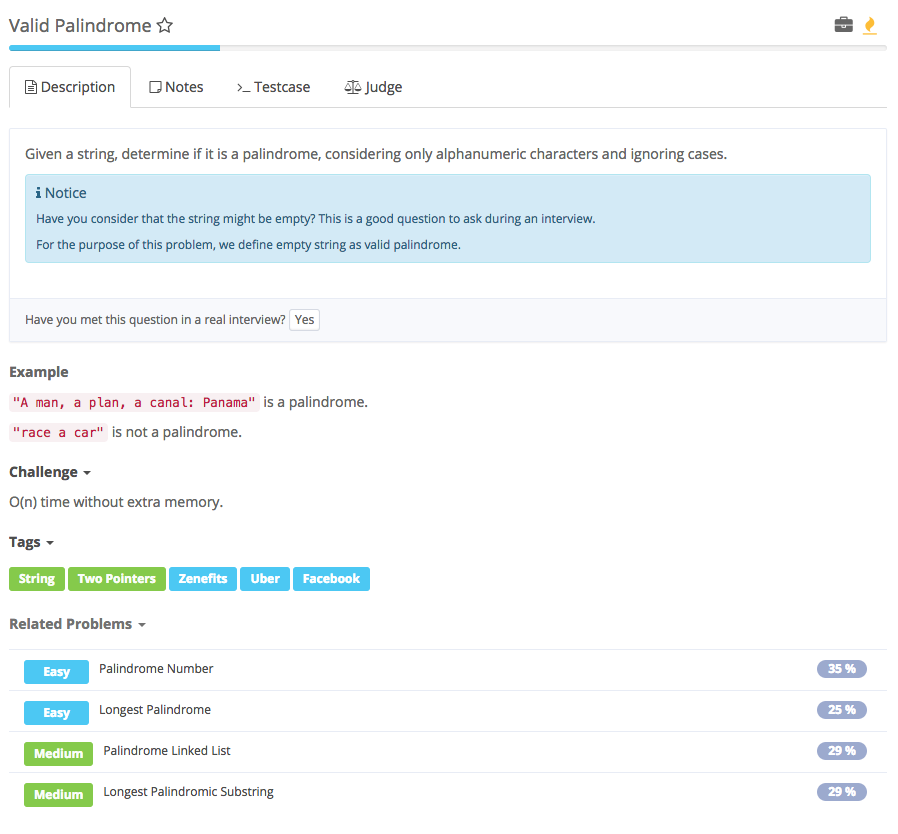

# Valid Palindrome



## Analysis

### Idea:

1. two pointers left = 0 right = s.length - 1 
2. 判断是否为标点符号，是的略过 需要判断是否到底 left、right各自找到第一个为字母数字的符号 两者进行判断 不一样直接break 一样继续进行  直到两指针相遇 left &lt;= right

```text
public class Solution {
    /*
     * @param s: A string
     * @return: Whether the string is a valid palindrome
     */
    public boolean isPalindrome(String s) {
        // write your code here
        if (s == null || s.length() == 0) {
            return true;
        }
        int left = 0, right = s.length() - 1;
        while (left < right) {
            // 判断是否为字符 不是的话略过 如标点符号 
            while (left < s.length() && !isValid(s.charAt(left))) {
                left++;
            }
            // 特殊情况，全是标点符号等，left到底
            if (left == s.length()) {
                return true;
            }
            while (right >= 0 && !isValid(s.charAt(right))) {
                right--;
            }
            // ignoring cases so all transfer to lower case
            if (Character. toLowerCase(s.charAt(left)) != Character.toLowerCase(s.charAt(right))) { //*convert to lowercase
                break;
            } else {
                left++;
                right--;
            }
        }
        return right <= left;  //*这样在字母不相等时，break后还能返回false
    }
    // 注意返回值
    private boolean isValid (char c) { //*
        return Character.isLetter(c) || Character.isDigit(c);
    }
}
```

### 知识点：

**String** 1. 长度函数有括号，数组的没有 string.length\(\)

**char** 1. 判断是否为字母函数： 【C要大写】Character.isLetter\(c\) 判断是否为数字函数： Character.isDigit\(c\) lowerCase函数：Character.toLowerCase\(c\) UpperCase函数：Character.toUpperCase\(c\) 3. 创建函数注意确定返回值是什么

