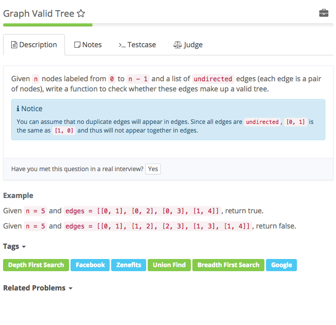

# @graph valid tree



## Analysis

### Idea:

This problem can be converted to finding a cycle in a graph. It can be solved by using DFS \(Recursion\) or BFS \(Queue\). 1. valid tree 条件 root 只有left 和 right两个children 首先tree必须保证n个点只有n-1条边。然后必须保证所有点在一个联通分量中，并且无环。 有两种方法： 1. 用UF，将边上的两个点归并到同一个联通分量中，若已经在同一个分量中的两个点之间还有边，则有环 2. 从一个点开始，用BFS，若能遍历所有点则所有点在一个联通分量中

```text
// version 1: BFS
public class Solution {
    /**
     * @param n an integer
     * @param edges a list of undirected edges
     * @return true if it's a valid tree, or false
     */
    public boolean validTree(int n, int[][] edges) {
        if (n == 0) {
            return false;
        }

        if (edges.length != n - 1) {
            return false;
        }

        Map<Integer, Set<Integer>> graph = initializeGraph(n, edges);

        // bfs
        Queue<Integer> queue = new LinkedList<>();
        Set<Integer> hash = new HashSet<>();

        queue.offer(0);
        hash.add(0);
        while (!queue.isEmpty()) {
            int node = queue.poll();
            for (Integer neighbor : graph.get(node)) {
                if (hash.contains(neighbor)) {
                    continue;
                }
                hash.add(neighbor);
                queue.offer(neighbor);
            }
        }

        return (hash.size() == n);
    }

    private Map<Integer, Set<Integer>> initializeGraph(int n, int[][] edges) {
        Map<Integer, Set<Integer>> graph = new HashMap<>();
        for (int i = 0; i < n; i++) {
            graph.put(i, new HashSet<Integer>());
        }

        for (int i = 0; i < edges.length; i++) {
            int u = edges[i][0];
            int v = edges[i][1];
            graph.get(u).add(v);
            graph.get(v).add(u);
        }

        return graph;
    }
}
```

```text
// version 2: Union Find
public class Solution {
      class UnionFind{
        HashMap<Integer, Integer> father = new HashMap<Integer, Integer>();
        UnionFind(int n){
            for(int i = 0 ; i < n; i++) {
                father.put(i, i); 
            }
        }
        int compressed_find(int x){
            int parent =  father.get(x);
            while(parent!=father.get(parent)) {
                parent = father.get(parent);
            }
            int temp = -1;
            int fa = father.get(x);
            while(fa!=father.get(fa)) {
                temp = father.get(fa);
                father.put(fa, parent) ;
                fa = temp;
            }
            return parent;

        }

        void union(int x, int y){
            int fa_x = compressed_find(x);
            int fa_y = compressed_find(y);
            if(fa_x != fa_y)
                father.put(fa_x, fa_y);
        }
    }
    /**
     * @param n an integer
     * @param edges a list of undirected edges
     * @return true if it's a valid tree, or false
     */
    public boolean validTree(int n, int[][] edges) {
        // tree should have n nodes with n-1 edges
        if (n - 1 != edges.length) {
            return false;
        }

        UnionFind uf = new UnionFind(n);

        for (int i = 0; i < edges.length; i++) {
            if (uf.compressed_find(edges[i][0]) == uf.compressed_find(edges[i][1])) {
                return false;
            }
            uf.union(edges[i][0], edges[i][1]);
        }
        return true;
    }
}
```

### Reference

[1](https://aaronice.gitbooks.io/lintcode/content/union_find/graph_valid_tree.html) [Program Creek: Graph Valid Tree \(Java\) DFS & BFS](http://www.programcreek.com/2014/05/graph-valid-tree-java/) [Princeton Union Find](https://www.cs.princeton.edu/~rs/AlgsDS07/01UnionFind.pdf)

