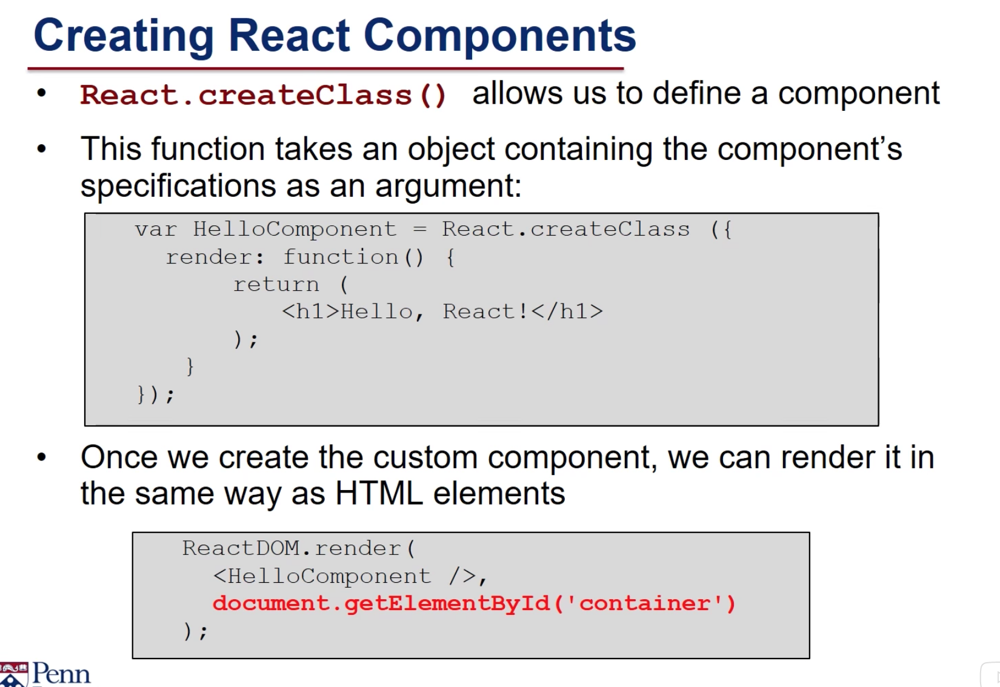
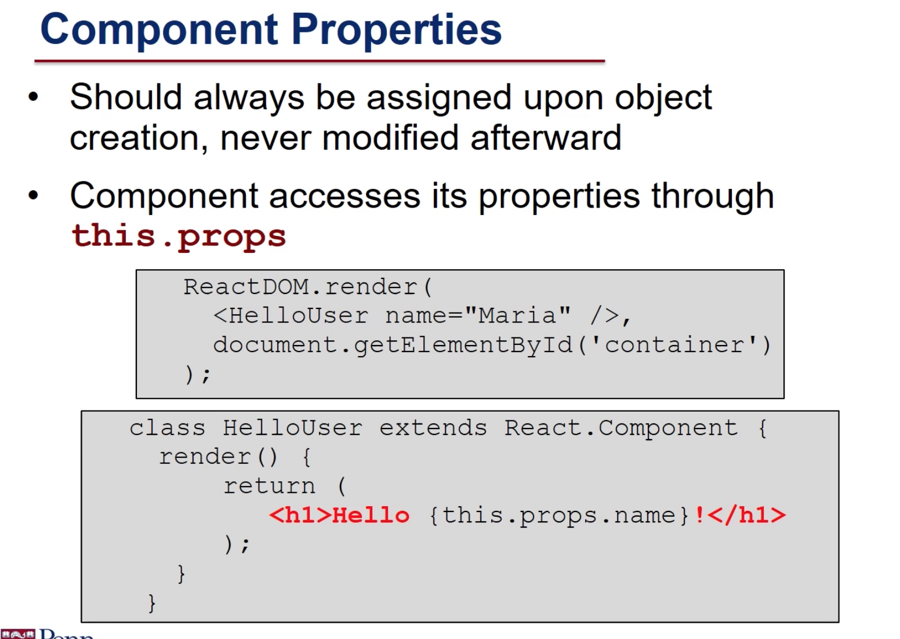
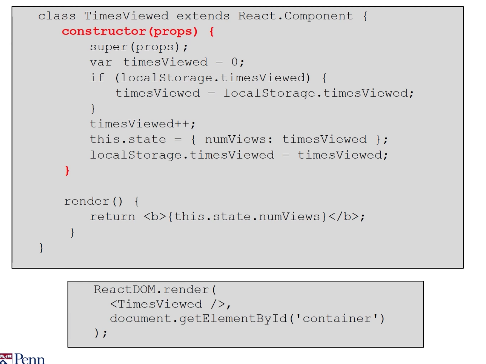

# React Componet

React, a JavaScript library for building dynamic webpages.  
The most important part of React is this idea of components.

## Components

### Definition

Components are modular, reusable chunks of code that we can drop into our HTML pages and that dynamically generate content based on their state and user events.  
React components are **JavaScript objects**  
that are based off **the React.Component prototype.**

In this lesson, we'll start to see how to define components and how we can include them in our html pages.  
And in the next few slides, we'll see two different ways to create react components.

### React components have four important parts

1. properties
2. state variables
3. callback functions or event handlers
4. render function, which is used to generate the HTML.

### VirtualDOM

The VirtualDOM manages each component and calls the render function whenever it's time to re-render that component.

## Creating a react component

1. \(Classic Way\) **React.createClass function** and pass it an object which contains the component specification.
   1. we're creating a variable called HelloComponent which will be an object, and we'll use this React.createClass function to create that object.
   2. The argument to createClass is itself an object. That one of the properties of that object is render which is a function that will be called when it's time to draw or render this component.
   3. The render function needs to return the HTML to be rendered, to be drawn and here we're using JSX. JSX is a technology that allows us to embed HTML right in our JavaScript.
   4. Once we've created the custom component in our JavaScript, then we can render it or drop it into our HTML using the reactDOM.render function.

      ReactDOM.render takes two arguments.The first is the JSX or HTML that we want to render. Here we see that we're rendering a component called hello component, which is the one that we just created. You can think of it as creating new HTML tags.

      The second argument to rReactDOM.render is the location of where we want to drop or place that component, and here we're using the DOM. We created a div called container, we're selecting that element by its ID, and we'll put the HelloComponent at that location in the HTML.
2. using the notation from a version of JavaScript known as ES6. the ES6 is the most recent version of JavaScript and allows us to **create a class** instead of a single object. This is the notation or the syntax that I'll use the rest of this week when creating react components.
   1. Rather then creating a variable called HelloComponent, we'll create a class. This class will extend the React. Component base class. \(using React. Component as the prototype\)
   2. Defining the render function in our class. Which looks the same as it did before and will be invoked when we drop this component into the html.

### Properties: attributes + value

~~Definition:~~  
the component's properties, properties are the attributes and values that **are set when the component is created, they should never be modified after initialization.**

1. A component can **access its propertie**s through a property called **props**, which is an object containing all of the property values.
2. We can **set the properties** of a component when we render the component **using ReactDOM.render**.

~~Example~~

1. A component called HelloUser, and we set its name property to the string Maria.

   So you can think of this as passing a variable or passing an argument to the component when its' created but what we're doing is setting it's name property.

2. In the component I have my hello user component and in it's render function I can return some HTML for instance hello and then I can access the property using **this.props.name**. This.props is the name of the property in the component. **It is an object and one of its properties is name which was initialized when we rendered this component using ReactDOM.render.**

### State???

~~Definition:~~  
the state is also attributes and values, but they **represent the current state of the component**, based on what it does or represents. They **can and should be modified during the component's life cycle.**

1. The state is always initialized in the **constructor**, which is the function that's called when the component or object is created.
2. The component can access the state properties, using this.state.

**Note:**  
both the properties and the state can be used when rendering the component, but the important difference is that properties are set when the component is initialized, and state changes during the component's life.

~~Example:~~

  
In this example we'll show the number of times that this page has been viewed.

1. Create a component called TimesViewed, and it will have a constructor. 
2. The constructor is the function that's called when this component or object is created.
   1. The arguments to the constructor are the props and we'll need to pass those to the super class constructor using this notation **super\(props\)**. 
   2. Demo initialize a variable called timesViewed = 0, and then we'll look in local storage. local storage was a way of storing values in between accesses to a webpage. 
   3. If local storage has a property called timesViewed then we will set our local timesViewed variable to that value.

      If it doesn't have a times viewed, then timesViewed will still be 0, so that when we increment it here, we're incrementing it either to one, if it's the first time, or incrementing whatever its previous value was.

   4. _Setting the state of this component._ We use _**this.state**_ **to access it's state**. And we **set it to this object** where we have the property numViews and the variable timesViewed.
   5. Last, to make sure this works for the next time we open this page, we need to update localStorage.
   6. Then we have the render function for times viewed. The render function will return some text in bold and it will return the numViews variable from the state.

That is, if we can access this component's state using this.state. State is an object and one of its properties is numViews. And this will return the number of views which we set here in the state,

### the component life cycle.

Each component goes through **three stages** of it's life  
1. where it's being created, or as we say, **mounted**.  
2. where it's being updated,  
3. where it's being destroyed or as we say **unmounted**.

At each point of its life cycle, React can invoke, optionally, different functions\(funct types depend on the life cycle stage, has 3 types in total\) that you can write for controlling the component.

1. The first part of the component's life is where it's being created, or as we say, mounted. Following are the functions can be invoked in mounting stage.
   1. We already saw the **constructo**r, which is the function that's called when the component is created and initializes the state potentially based on the properties.
   2. Then before the component is added to the VirtualDOM the component will **componentWillMount** is called, in this function we can do any work that we want to do before we add it to the VirtualDOM. 
   3. Once it's added to the VirtualDOM then the render function is called and then after that **ComponentDidMount** is invoked and at that point the component can start accessing other parts of the VirtualDOM.
2. Next in the components life is its cycle of being updated. how the component can react to user events.

   **four callback** functions  
   those can be invoked when a component's props or state is changing and the component is re-render.

   1. componentWillReceiveProps

      This is invoked right before it receives new props, for instance, when its parent is being re-rendered.

   2. shouldComponentUpdate

      This allows us to compare the old props to the new props in case we need to do anything. The component doesn't have to be re-rendered.  
      Before it's re-rendered, the shouldComponentUpdate is called, and that returns a boolean, indicating whether this component should be re-rendered.

   3. componenWillUpdate

      If its about to be re-rendered, the componenWillUpdate is called

   4. componentDidUpdate

      and then after its re-rendered, componentDidUpdate is called.

3. Last When it's the end of the component's life and it's about to be removed from the VirtualDOM
   1. componentWillUnmount

      the componentWillUnmount function is invoked.

In this lesson, we've seen how to create a component,  
how to specify it's properties and it's state, and how to use it's render \(\) function to use JSX to render the HTML for that component.

In the next lesson,  
we'll start looking at how the component can react to user events.

